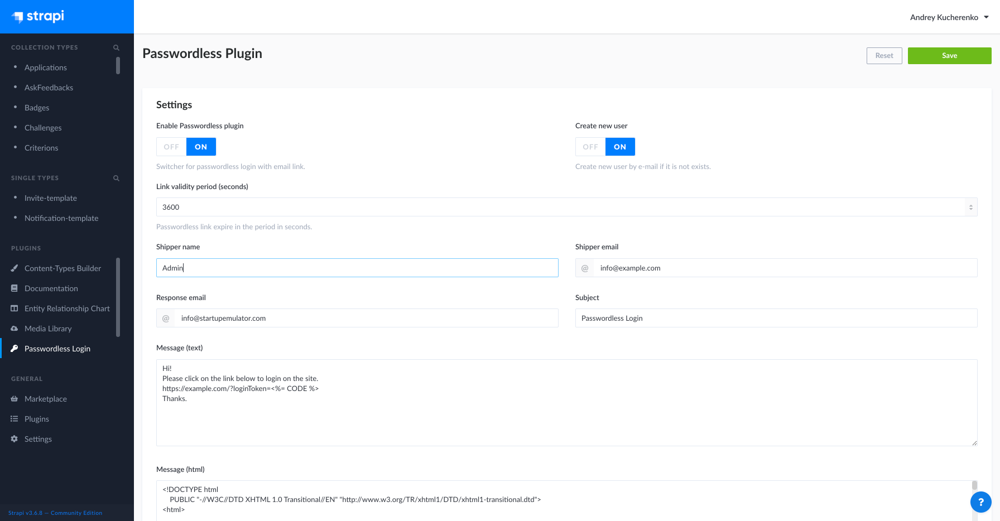

# Strapi PasswordLess Plugin

A plugin for [Strapi Headless CMS](https://github.com/strapi/strapi) that provides ability to sing-in/sing-up to an application by link had sent to email. 
A plugin works together with [Strapi User Pemissions Plugin](https://github.com/strapi/strapi/tree/master/packages/plugins/users-permissions) and extends it functionality. 
For working with emails a plugin use [Strapi Email Plugin](https://docs.strapi.io/developer-docs/latest/plugins/email.html).



## ⏳ Installation

Install Strapi with this **Quickstart** command to create a Strapi project instantly:

- (Use **yarn** to install the Strapi project (recommended). [Install yarn with these docs](https://yarnpkg.com/lang/en/docs/install/).)

```bash
# with yarn
yarn create strapi-app my-project --quickstart

# with npm/npx
npx create-strapi-app my-project --quickstart
```

_This command generates a brand new project with the default features (authentication, permissions, content management, content type builder & file upload). The **Quickstart** command installs Strapi using a **SQLite** database which is used for prototyping in development._

- Configure the `Strapi email` plugin ( [official documentation](https://docs.strapi.io/developer-docs/latest/plugins/email.html) )

- Add the `strapi-plugin-passwordless` plugin

```bash
yarn add strapi-plugin-passwordless@latest

# or

npm i -S strapi-plugin-passwordless@latest
```

- After successful installation you've to build a fresh package that includes plugin UI. To archive that simply use:

```bash
yarn build && yarn develop

# or

npm run build && npm run develop
```

- or just run Strapi in the development mode with `--watch-admin` option:

```bash
yarn develop --watch-admin

#or

npm run develop --watch-admin
```

The **Passwordless Login** plugin should appear in the **Plugins** section of Strapi sidebar after you run app again.

## 🔌 Usage

### REST API

#### Email user with login link
```
POST /passwordless/send-link
{"email": "user@email.com"}
```
#### Login with token
```
GET /passwordless/login?loginToken={tokenFromEmail} 
```
Response:
```
{
  "jwt":  "...jwt auth token..."
  "user": {
    ...strapi user...
  }
}
```

### GraphQL API

```graphql
sendLoginLink(email: String): PasswordlessSendLinkPayload!
loginPasswordless(loginToken: String): PasswordlessLoginPayload!
```

## 🙌 Versions 

 - `strapi-plugin-passwordless@3.x` - version for strapi v3
 - `strapi-plugin-passwordless@4.x` - version for strapi v4 (not ready yet, WIP)

## 🤝 Contributing

Feel free to fork and make a Pull Request to this plugin project. All the input is warmly welcome!

## ⭐️ Show your support

Give a star if this project helped you.

## License

[MIT License](LICENSE.md) Copyright (c) [Andrey Kucherenko](https://github.com/kucherenko).